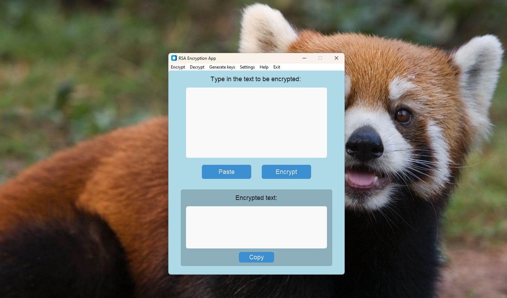
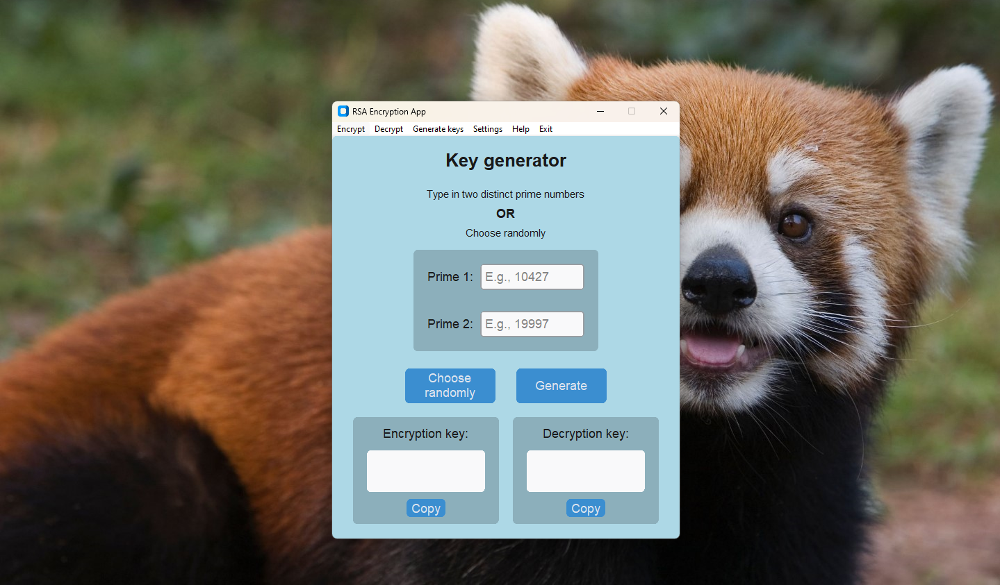
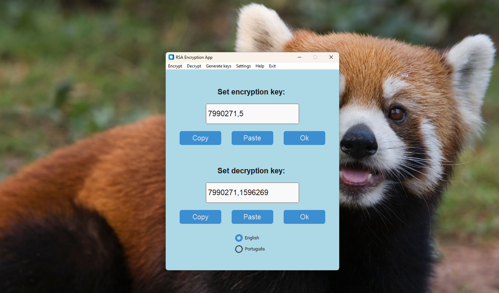

# RSA-Encryption-App  

## 🇺🇸 RSA based desktop app using python's CustomTkinter UI-library  
## 🇧🇷 Aplicativo desktop baseado em RSA usando a biblioteca CustomTkinter do Python  

---

## Description / Descrição 
This application's objective is to use RSA cryptography for message encryption.  

---

O objetivo desta aplicação é utilizar a criptografia RSA para a encriptação de mensagens.  

---

## Features / Funcionalidades 
* Message encryption  
* Message decryption  
* Encryption keys generation  

--- 

* Encriptação de mensagens  
* Decriptação de mensagens  
* Geração de chaves de encriptação  

---

## Dependencies / Dependências
* Python 3.11.9
* CustomTkinter 5.2.2
* SymPy 1.14.0
## Screenshots  

    
    
    
    

  

## Demo  

    <video width="680" height="425" controls>
    <source src="./demo/video/videoDemo.mp4" type="video/mp4">
    Your browser does not support the video tag.
    </video>

  
